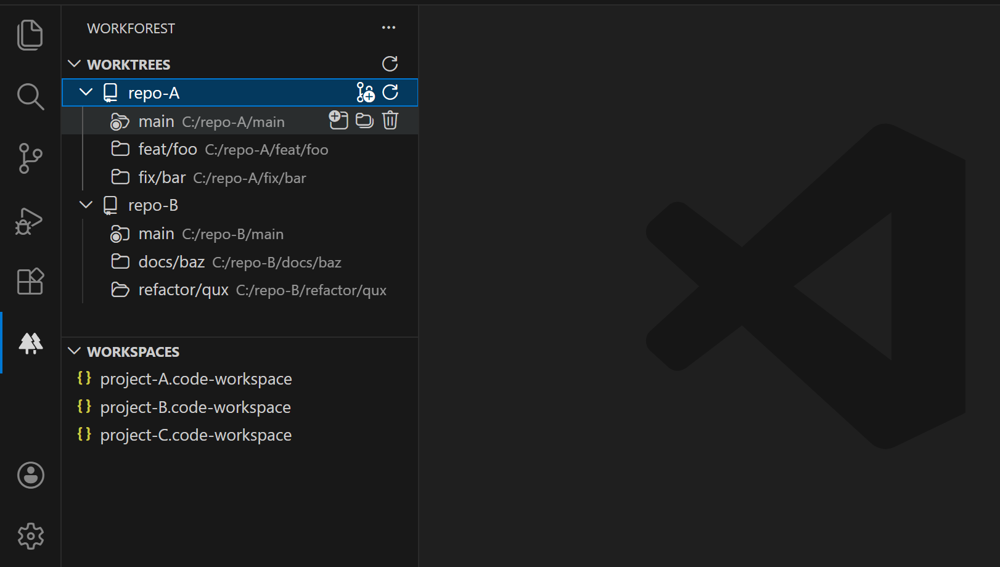

# Workforest

Extension to conveniently visualize, open, and switch between git worktrees and vscode workspaces.

## Worktrees

Workforest discovers git repositories open in the workspace and displays a list of their worktrees in an Activity Bar View. Workforest allows for an open worktree to be replaced by another worktree of the same repository. Worktrees may also be opened in a new window.

In addition, Workforest allows to perform simple operations on repository worktrees, such as adding and removing worktrees (and optionally deleting branches checked out by removed worktrees).

#### Notes on adding worktrees

To add a worktree, either a path or a branch name is required. When a path is provided, it is resolved relative to the main worktree's directory, and a branch is created with the path's basename. If a branch name is provided, the worktree is added with path `../${branchName}` (resolved relative to main worktree's directory). This implies that branch names containing `"/"` may be used to customize worktree paths; for example, a branch named `fix/foo` will add a worktree at path `../fix/foo`.

#### Note on multi-root workspaces

In multi-root workspaces, switching the workspace's first folder triggers a reload which makes the process somewhat slower (see [`updateWorkspaceFolders`](https://code.visualstudio.com/api/references/vscode-api#:~:text=%7C%20undefined%3E-,updateWorkspaceFolders,-\(start%3A)). When possible, it is recommended to keep a folder with no worktrees as the workspace's first folder.

## Workspaces

Workforest allows to register a directory path through the `workforest.workspaceDirectory` configuration option to scan for root `.code-workspace` files and display them in the Workforest Activity Bar View. From there, workspaces may be opened in the current or a new window, and their files may be opened in the editor.